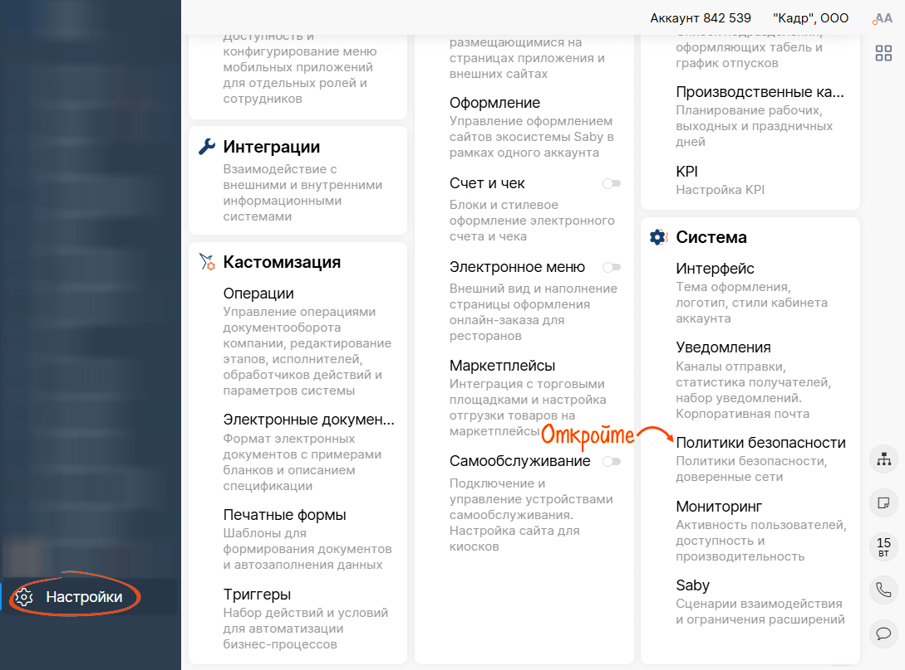
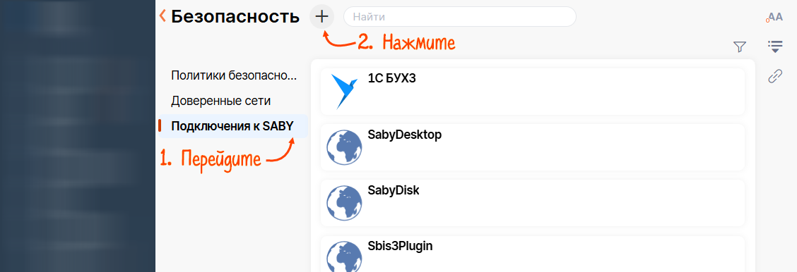
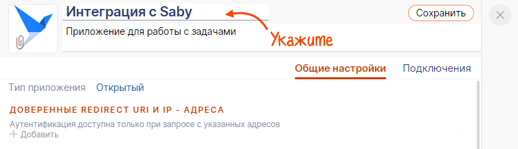
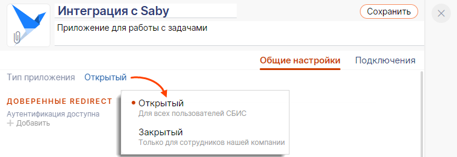
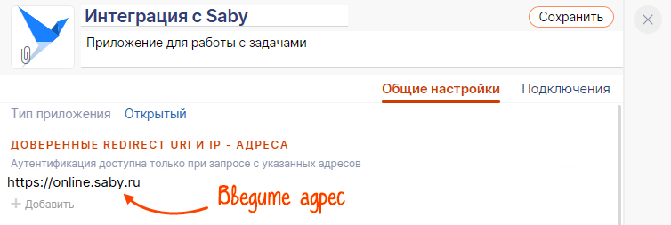
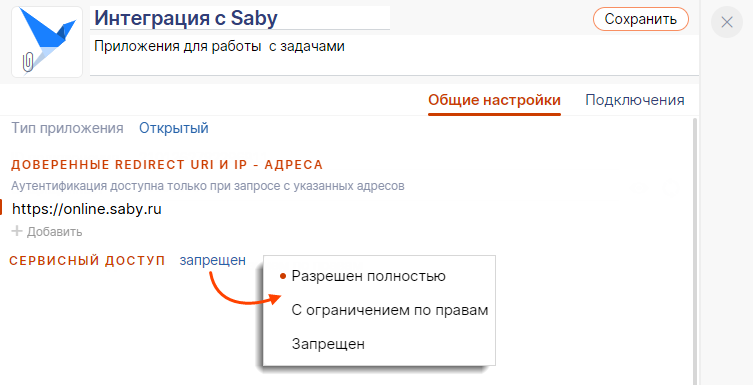
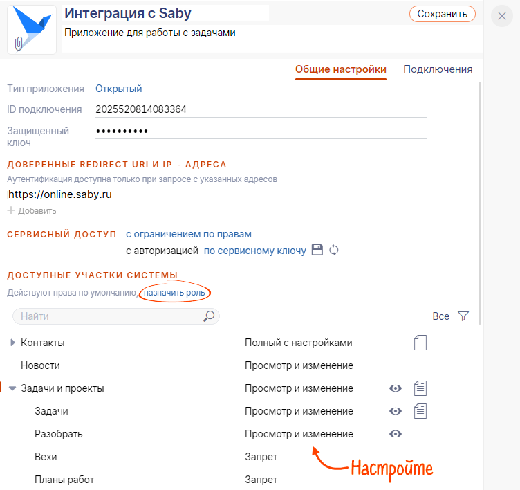
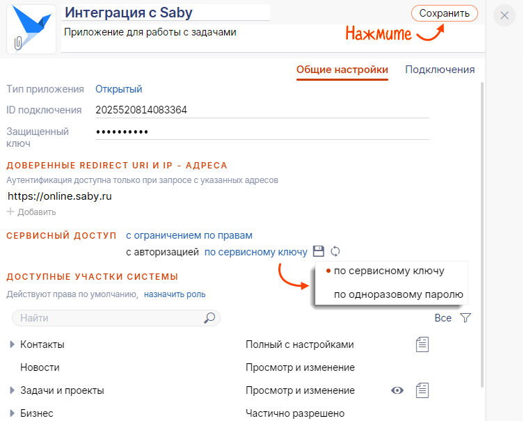

# Добавить внешнее приложение в Saby

Добавить внешнее приложение в Saby

Saby умеет работать со сторонними приложениями. Например, вы можете добавить приложение, чтобы авторизоваться через Saby на своем сайте или синхронизировать данные о сделках с внешней CRM.

1.  В личном кабинете Saby перейдите в раздел «Настройки» и в блоке «Система» откройте «Политики безопасности».
    
    
    
2.  Перейдите в раздел «Подключения к Saby» и нажмите .
    
    
    
3.  Укажите название приложения и его описание. По желанию добавьте картинку или логотип.

5.  Выберите тип приложения.
    
    
    
6.  Добавьте адрес внешней системы или IP-адрес, с которого будут разрешены запросы в Saby. Если этого не сделать, то запросы авторизации будут разрешены с любого адреса.
    
    
    
7.  Разрешите внешнему приложению сервисный доступ в Saby и установите права для него:
    
    -   «Разрешен полностью» — пользователь получит максимальный доступ к системе;
    -   «С ограничением по правам» — у пользователя будут минимальные права. Укажите, к каким участкам системы у приложения будет доступ.
    
    
    
    -   Как настроить доступ?
        Выберите роль или назначьте права на каждом участке системы.

        
8.  Выберите тип авторизации:
    -   «по сервисному ключу» — для авторизации понадобится ключ, который автоматически генерируется в Saby, когда вы завершите настройку. Его можно скачать и использовать в запросах по API;
    -   «по одноразовому паролю» — каждый раз для авторизации надо вводить пароль, который генерируется при запуске вашего приложения.
9.  Нажмите «Сохранить».
    
    
    

Внешнее приложение добавлено в Saby.