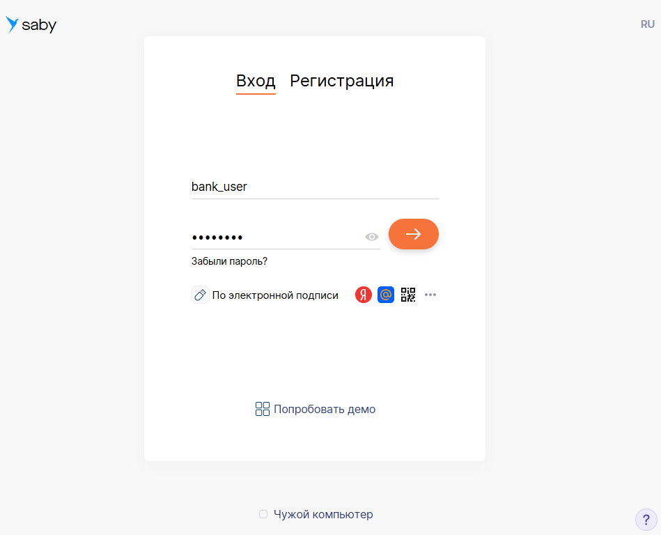
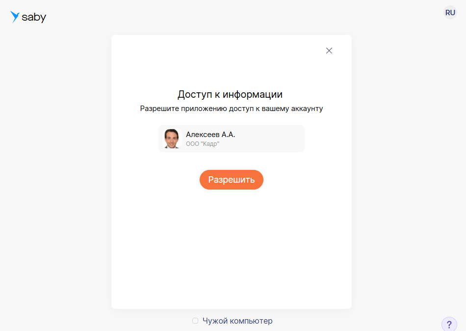

# Настроить интерактивную авторизацию в Saby

Настроить интерактивную авторизацию в Saby

Вы можете встроить приложение на внешний сайт с помощью визуального элемента, например кнопки. Нажав ее, пользователь авторизуется в Saby.

Для интерактивной авторизации используется протокол [OAuth 2](https://oauth.net/2/). Он позволяет пользователям внешней системы войти на сайт online.saby.ru, а затем передает права на выполнение запросов.

Когда пользователь разрешает приложению доступ к информации, внешней системе передается токен доступа. Это набор символов (ключ), который определяет, какое именно приложение авторизуется в Saby и какие участки системы ему доступны.


Параметры приложения для интеграции:

-   **client_id= <client_id>**,
-   **client_secret= <client_secret>**.

## Выполнить запрос

«Token» — обязательное поле для авторизации, используемое внешним приложением для выполнения запросов в системе Saby. Авторизационные данные передаются в заголовке:

X-SBISAccessToken: <access_token> — токен доступа приложения для работы с API Saby.

## Получить токен доступа

Если авторизация происходит через браузер, получите токен через код подтверждения: пользователь вводит логин и пароль, система выдает код, который ваш сайт отправляет на сервер для обмена на токен. Если приложение работает на сервере и пользователь не участвует, сервер запрашивает токен напрямую.

### Авторизация через браузер


1.  На внешнем сайте поместите визуальный элемент, например кнопку. Она будет нужна для взаимодействия с Saby.
2.  Создайте обработчик, который при нажатии кнопки во всплывающем окне будет открывать адрес для идентификации приложения.  
    **Адрес для идентификации**: https://online.sbis.ru/oauth/api/token?
    
    **Параметры запроса:**
    
     \* — обязательный параметр.
    
    -   "client_id"\* : идентификатор приложения;
    -   "redirect_uri"\* : адрес, на который будет перенаправлен пользователь после успешной аутентификации в Saby;
    -   "response_type" : тип ответа. Возможные значения «code» и «token», по умолчанию «token»;
    -   "state" : строка состояния, которую Saby вернет без изменений;
    -   "scope" : область действия запроса на доступ в виде списка строк, разделенных пробелами. Например, «openid profile email».
    
    Скрипт ниже выполняет переход в новое окно с адресом для идентификации:

    ```
    window.open("https://online.sbis.ru/oauth/api/token?client_id=<mb_client_id>&response_type=<needed_response_type>&scope=<needed_scope>&state=<random_state>&redirect_uri=https://other-site.ru/", "Подключение к СБИС", "scrollbars=1,toolbar=0")
    ```

3.  Введите логин и пароль.
    
    
    
4.  Разрешите доступ к аккаунту.
    
    
    
5.  Перейдите на внешний сайт в зависимости от параметра запроса «response_type»:
    -   code
        
        Если в запросе на идентификацию в параметре «response_type» передано значение «code» и доступ к аккаунту разрешен, приложение отправит код подтверждения на внешний сайт:
        
        https://other-site.ru/code=<generated_code>
        
        Код действителен 60 секунд.
        
        Обменяйте код подтверждения на токен доступа через POST-запрос. Токен доступа понадобится в вызовах API-команд.
        
        Пример получения access_token:
        
        POST /oauth/service/token HTTP/1.1  
        Host: online.sbis.ru  
        Content-type: application/x-www-form-urlencoded  
        
        Параметры:
        
        \* — обязательный параметр.
        
        -   "code"\*: полученный код подтверждения;
        -   "client_id"\*: идентификатор приложения;
        -   "client_secret"\*: секретный ключ приложения.
        
    -   token
        
        Если в запросе на идентификацию в параметре «response_type» передано значение «token» и доступ к аккаунту разрешен, приложение отправит токен на внешний сайт:
        
        https://other-site.ru/access_token=<generated_token>
        

### Авторизция через Серверные коды

1.  На внешнем сайте поместите визуальный элемент, например кнопку. Она будет нужна для взаимодействия с Saby.
2.  Создайте обработчик, который при нажатии кнопки во всплывающем окне будет открывать адрес для идентификации приложения.  
    **Адрес для идентификации**:  
    https://online.sbis.ru/oauth/api/token?client_id=<client_id>&client_secret=<secret_key> &redirect_uri=https://other-site.ru/  
    Скрипт ниже выполняет переход в новое окно с адресом для идентификации:
    
    ```
    window.open("https://online.sbis.ru/oauth/api/token?client_id=<mb_client_id>&client_secret=<mb_secret_key>&redirect_uri=https://other-site.ru/", "Подключение к СБИС", "scrollbars=1,toolbar=0")
    ```
3.  Для идентификации Saby запросит логин и пароль, которые пользователь должен ввести в окне авторизации.
    
    
    
4.  На следующем шаге приложение запросит согласие на доступ к данным пользователя.
    
    
    
5.  Если пользователь разрешил приложению доступ к аккаунту, приложение отправит токен доступа и идентификатор устройства пользователя на внешний сайт. Их можно использовать для доступа к API системы Saby. Токен позволяет переключаться между разными аккаунтами одного профиля через метод [СБИС.ПереключитьАккаунт](https://saby.ru/help/integration/api/all_methods/change_acc/).
    
    **Пример передачи токена и ИД устройства**: https://other-site.ru/#access_token=<access_token>
    

### Как получить информацию о текущем пользователе?
    
    Выполните GET или POST запрос.
    
    GET service / user_info HTTP / 1.1
    Host: online.sbis.ru
    
    X - SBISAccessToken: < access_token >
    
    Ответ
    
    {
            "Пользователь": 5863084,
            "ИмяПользователя": "Жилкина М.",
            "ЛогинПользователя": "админище",
            "МылоПользователя": null,
            "access": 0,
            "ИдентификаторСервисаПрофилей": "e78e3084-6b1e-4c4f-8bb1-a43ad787a48e",
            "isService": false,
            "ИдентификаторКлиента": 5855370,
            "ИмяКлиента": "ООО \\"Персонал и Зарплата\\"",
            "КлассПользователя": "__сбис__клиенты",
            "Фамилия": "Жилкина",
            "Имя": "Марина",
            "Отчество": null,
            "isClient": false,
            "guest": false,
            "anonymous": false,
            "isDemo": false,
            "isPersonalAccount": false,
            "UserInitials": "ЖМ",
            "real_enter": true,
            "not_my_computer": false
    }
    
    Поля ответа:
    
    -   "Пользователь": идентификатор пользователь в облаке;
    -   "ИмяПользователя": имя пользователя в облаке;
    -   "ЛогинПользователя": логин пользователя в облаке;
    -   "МылоПользователя": электронная почта;
    -   "access": уровень доступа пользователя в Saby;
    -   "ИдентификаторСервисаПрофилей": UUID пользователя на сервисе профилей;
    -   "isService": признак сервисного пользователя;
    -   "ИдентификаторКлиента": идентификатор клиента (аккаунта) в облаке;
    -   "ИмяКлиента": имя клиента в облаке;
    -   "КлассПользователя": класс пользователя;
    -   "Фамилия": фамилия пользователя;
    -   "Имя": имя пользователя;
    -   "Отчество": отчество пользователя;
    -   "isClient": признак входа под клиентом;
    -   "guest": признак гостевого пользователя;
    -   "anonymous": признак анонимного пользователя;
    -   "isDemo": признак демо пользователя;
    -   "isPersonalAccount": признак аккаунта физического лица;
    -   "UserInitials": инициалы пользователя;
    -   "real_enter": признак реального входа пользователя, клиента или физического лица;
    -   "not_my_computer": признак входа с чужого компьютера.
    

Авторизация Saby на вашем сайте настроена. Теперь пользователь может входить в систему через внешний сайт и работать с сервисами Saby.