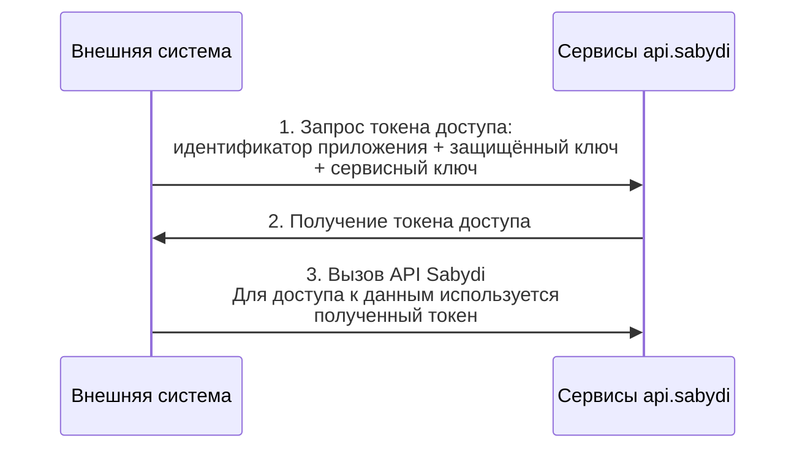

# Настроить сервисную авторизацию приложения в Saby

Настроить сервисную авторизацию приложения в Saby

Чтобы авторизировать внешнюю систему в Saby для обмена данными, в личном кабинете добавьте приложение и настройте сервисную авторизацию.

-   [Как добавить приложение?](https://saby.ru/help/integration/api/auth/add_app/)

## Как происходит обмен

1.  Внешнее приложение отправляет запрос на сервер Saby.
2.  Saby проверяет переданные идентификатор приложения (app_client_id) и ключи (app_secret, secret_key). Если все верно, сервер высылает ответ с токен доступа (access\token) для приложения.
3.  Приложение использует этот токен в заголовках запросов для работы с API Saby.

## Получить токен доступа

Токен доступа — обязательный параметр авторизации внешнего приложения в системе Saby. Он используется для выполнения всех API-запросов, включая чтение, запись и обновление данных.

Чтобы получить токен доступа, отправьте POST-запрос на сервер Saby. В теле запроса передайте:

-   app_client_id — ID приложения;
-   app_secret — защищенный ключ;
-   secret_key — сервисный ключ.

Эти параметры можно найти в настройках стороннего приложения.

-   [Как получить параметры приложения?](https://saby.ru/help/integration/api/auth/settings/)

**Адрес запроса**: https://online.sbis.ru/oauth/service/

Пример в формате *.php

В качестве примера используется [функция «cURL»](https://www.php.net/manual/ru/book.curl.php).

```php
<?php
$auth = array(
    'app_client_id'=>'760676789310629',
    'app_secret'=>'WHREDMVWJDHYFZO0CM83MHF',
    'secret_key'=>'9PT47e2j3JGwsswHAzHaU5ssyzoqHsIYFHLjtZYQhlqV8U7eIkF5VIYluyrGwugVv7g1dWRcbSnoCzk10gq961GdzfpUD7INYZiS0wR8K1lrbVwkMjvqi'
);
$auth = json_encode($auth);
$ch = curl_init();
curl_setopt_array($ch, array(
    CURLOPT_SSL_VERIFYPEER => false,
    CURLOPT_RETURNTRANSFER => true,
    CURLOPT_URL => 'https://online.sbis.ru/oauth/service/',
    CURLOPT_POST => true,
    CURLOPT_HEADER => 0,
    CURLOPT_POSTFIELDS => $auth,
    CURLOPT_HTTPHEADER =>  array(
        'Content-type: charset=utf-8'
        )
));
$response = curl_exec($ch);
curl_close($ch);
?>
```


Пример запроса в формате \*.py

В качестве примера используется библиотека [«Requests»](https://requests.readthedocs.io/).
```python
import requests
json={"app_client_id":"7760676789310629","app_secret":"RWHREDMVWJDHYFZO0CM83MHF","secret_key":"B9PT47e2j3JGwsswHAzHaU5ssyzoqHsIYFHLjtZYQhlqV8U7eIkF5VIYluyrGwugVv7g1dWRcbSnoCzk10gq961GdzfpUD7INYZiS0wR8K1lrbVwkMjvqi"}
url = 'https://online.sbis.ru/oauth/service/'    
response = requests.post(url, json=json)
response.encoding = 'utf-8'
print(response.text)
```

В ответе json-формата будет поле «token».

```json
{  
   "sid":"0056cbe3-00574213-00ba-09f3753ce2334692",
   "token":"PGE5O1JZWEJnU1dQJVo5OVEyWyhKLkJWS1RpNDZha2skY3J0MjwuTWtebk9TXTttIVhHLTZXOSFiN19FMlNvdDIwMTctMDQtMTcgMTA6NTE6MDIuNDM1NDEx"
}
```

## Выполнить запрос

Чтобы выполнять запросы к API, необходимо передавать токен доступа в заголовке каждого запроса:

X-SBISAccessToken: <token>

Это обязательный параметр, без которого API-команды не будут обработаны.

## Выйти из системы

Чтобы завершить использование токена доступа, передайте на сервер Saby POST-запрос и полученный токен в параметре token.

**Адрес запроса**: https://online.sbis.ru/oauth/service/

**Тело запроса**:
```json
{
   "event": "exit",
   "token": "RHRxMSFrNXc8OXheGohPkBdZkJdMlpPM05OcDp8JlZWaCVRldCbHJ6IWVpJCRyfnVNIzNDdjtjflcmazJ0ODIwMTgtMDctMDkgMTM6MDU6MTguNDgyNzY2"
}
```
