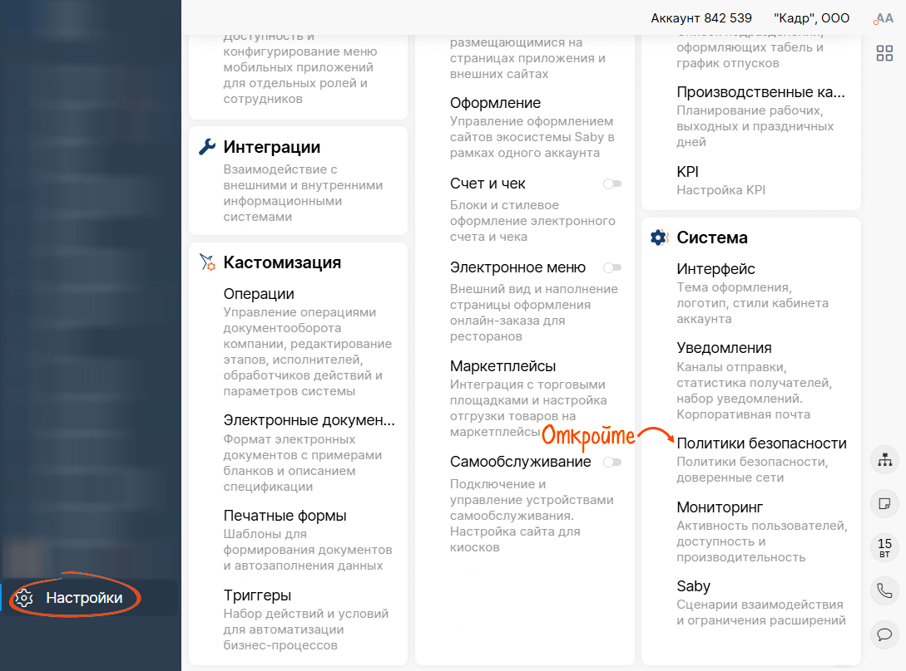
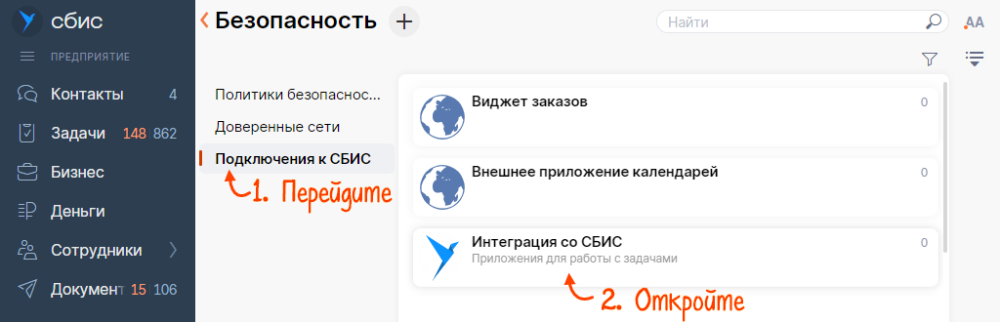
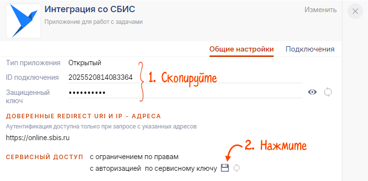

# Получить параметры приложения

Получить параметры приложения

Чтобы настроить интеграцию стороннего приложения со СБИС, используйте параметры для авторизации. Они станут доступны после того, как вы добавите внешнее приложение в систему и настроите доступ к нужным участкам.

1.  В личном кабинете СБИС перейдите в раздел «Настройки» и в блоке «Система» откройте «Безопасность».
    
    
    
2.  Перейдите в раздел «Подключения к СБИС» и откройте карточку приложения.
    
    
    
3.  Скопируйте:
    
    -   ID подключения;
    -   защищенный ключ;
    -   сервисный ключ. Для этого нажмите , откройте скачанный файл и скопируйте данные.
    
    
    

Укажите полученные данные в API-запросах на авторизацию. СБИС распознает приложение и предоставит доступ к выбранным разделам.